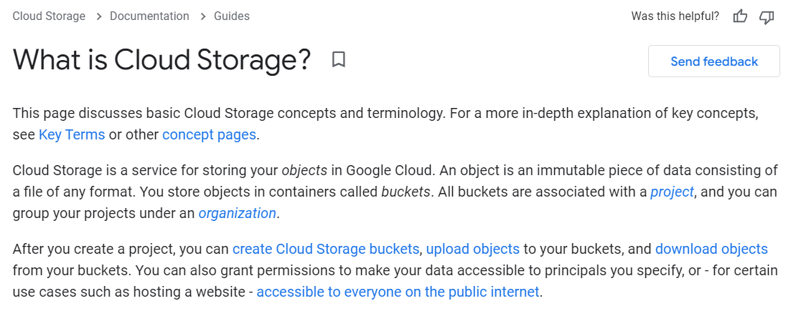
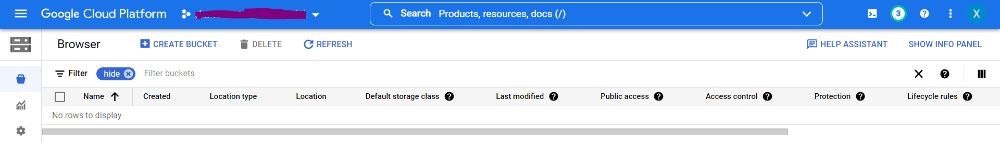
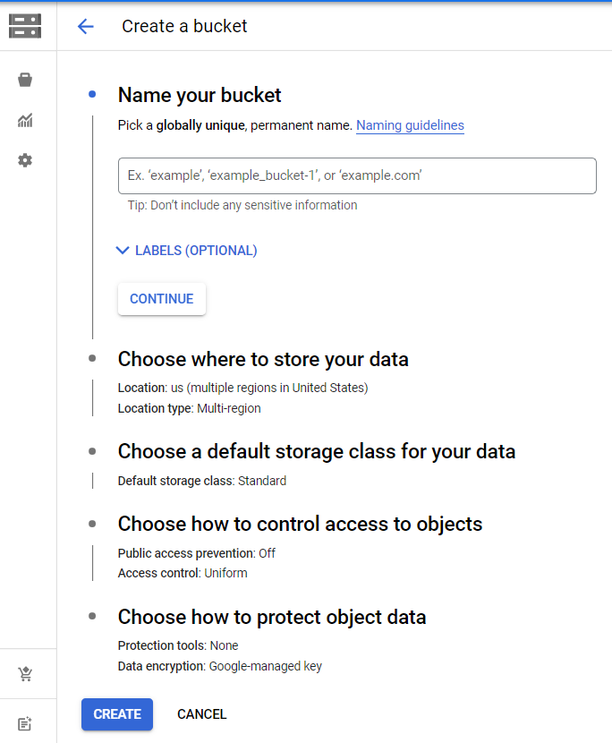
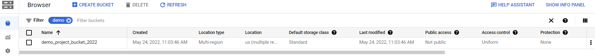
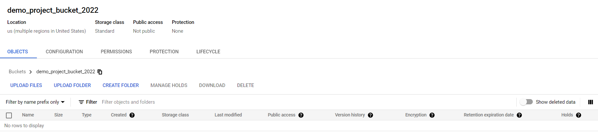
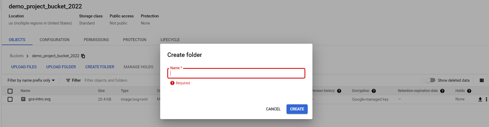
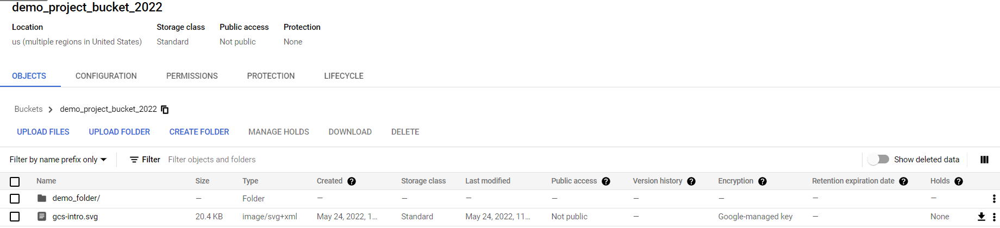
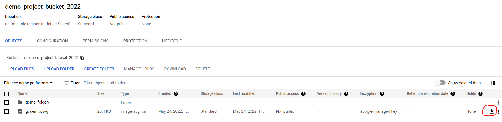

# 3分钟入门GCP之 - Cloud Storage

本文是学习GCP(Google Cloud Platform)系列文章得第一篇，主要介绍一下GCP应用最多的服务之一- Cloud Storage.
## 是什么？
以下是官网给出的简介

翻译一下就是：

Cloud Storage 是Google Cloud 上的对象存储系统。所谓对象是指任何格式文件里的不可变的数据。这些对象是存储在叫做bucket的容器里面。所有的bucket都关联到指定的项目，并且不同项目可以在组织里面管理。
当你创建完项目，你可以创建桶，并且从对应的桶中上传或下载对象文件。并且还可以授权对象的访问权限，还可以应用于特定的业务场景，比如建立一个基于桶创建一个网站。

## 快速入门

本文以Google Cloud 控制台，来简单介绍Cloud Storage方面的知识，包括如何创建bucket,如何上传、下载文件。
打开Google Cloud 控制台，进入到Cloud Storage的管理界面，如下所示（demo演示隐藏了创建好的bucket）。

1 点击“CREATE BUCKET”按钮，进入到bucket创建的详情界面

给你的bucket起一个全局唯一的名字（一般以项目名称为前缀），本文就叫“demo_project_bucket_2022”。还有一些其他选项，比如数据存储位置，格式，权限控制等，会在后面的文章介绍。

2. 点击“CREATE” 按钮，开始创建，创建后便可以在控制台看到创建好的bucket了。

3. 点击bucket名称，即可进入到bucket的详细页面。

4. 可以看到目前该bucket下面没有任何文件，我们来手动上传一个本地的图片到该bucket下面。点击"UPLOAD FILES" ,弹出选择文件对话框，选择要上传的本地文件，点击“打开”，开始上传。上传完成后bucket下面会显示所有已经上传的文件。

5. 我们还可以创建文件夹。点击“CREATE FOLDER” ，输入名称，点击”CREATE“, 就创建成功了。

6. 下载文件，点击右侧得下载图标就可以把文件下载到本地。

