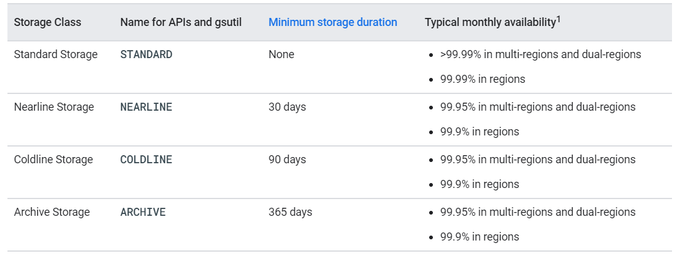

# 3分钟入门GCP之 - Cloud Storage Class

## 什么是class?

官网给出的定义：

A storage class is a piece of metadata that is used by every object.

翻译一下：storage class 其实是存储对象的一段元数据。

## 几个关键的点：

   1. GCS 里的对象文件都可以定义一些元数据信息，storage class便是其中一个，由GCS管理；
   2. storage class主要影响两方面：数据的可用性，以及付费模型；
   3. storage class可以在创建桶时直接指定（默认storage class）,任何在桶内创建的对象，自动继承该storage class; 但也可以在创建对象时手动指定storage class以覆盖默认的值。

## 可用的storage class：

下图是官网storage class的列表：

一共有四种常用的storage class,分别是： Standard Storage, Nearline Storage,Coldline Storage, Archived Storage。

不用的storage class,适合的存储时间不同，从上到下递增；但数据可用性则从上至下依次减少。

可以简单理解为：越下层的storage class，好比是越便宜的存储，在费用上越便宜，但是代价就是数据可用性相对较上层的存储低一些。
默认的是Standard Storage。如果后期修改桶的storage class,已有的对象不受影响。

共同点：

所有的storage class都有如下共同点：
1. 任何object都没有大小限制；
2. 数据的可访问性和存储位置均是全球性的；
3. 访问延时低：首字节只需要毫秒级别；
4. 高持久性：99.999999999%的年持久性；
5. 地区冗余性：如果是多地区或两个地区存储，则具备地区冗余性；

下面是每个storage class的适用场景：
1. Standard storage: 适用于频繁访问（热数据），或者有确切存储时间要求的数据；
2. Nearline storage: 数据访问、修改的频率大于一个月，适用于数据备份。数据存储花费相对较少；
3. Coldline storage: 数据访问、修改的频率大于90天。提供比Nearline更小的存储花销；
4. Archive storage: 数据访问、修改的频率大于一年。适用于数据备份和灾难恢复等场景。

GCS（google cloud storage）的storage class 就介绍到这。