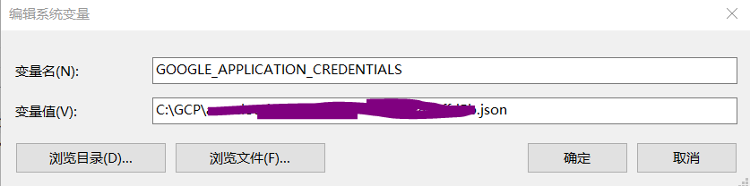

# 3分钟入门GCP之 - 搭建本地开发环境

## 创建service account

一般我们在本地开发调试GCP相关的代码，需要一个认证方式。通常的方式是，在GCP项目上创建一个service account(可以看作是一个访问实体)，然后授予一定的访问权限（我们一般创建owner权限）就可以用该service account 访问GCP上对应的服务了。
创建service account并授予owner权限：

## 下载service account key file：

service account key file是我们用来认证并授权访问GCP的钥匙。直接可以从console平台下载：

## 配置环境变量：

增加一个环境变量，变量名叫“GOOGLE_APPLICATION_CREDENTIALS”，值是本地下载的service account key file的路径：

至此，就可以用在本地，用代码访问GCP上的相关服务了。