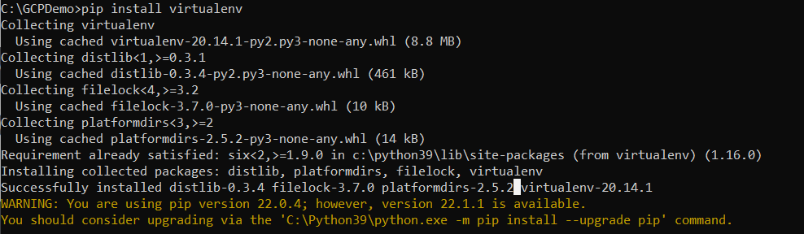
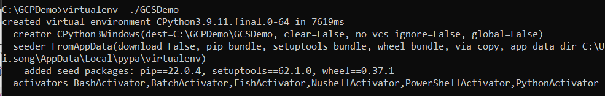
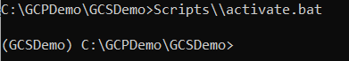
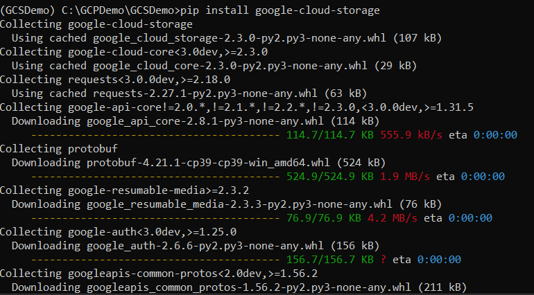

# 3分钟入门GCP之 - GCS之python编程

## 本地环境搭建

参考这篇文章“3分钟入门GCP之 - 搭建本地开发环境”


## 创建Python开发环境







下载gcs python第三方包：


OK,至此，我们可以用python代码访问GCS了!


## 创建bucket：

```python
import sys
from google.cloud import storage


def create_bucket(bucket_name):

    bucket_name = "your-new-bucket-name"

    storage_client = storage.Client()

    bucket = storage_client.create_bucket(bucket_name)

    print(f"Bucket {bucket.name} created")


# [END storage_create_bucket]

if __name__ == "__main__":
    create_bucket(bucket_name=sys.argv[1])
```


## 上传文件：

```python
def upload_blob(bucket_name, source_file_name, destination_blob_name):
    """Uploads a file to the bucket."""
    # The ID of your GCS bucket
    bucket_name = "your-bucket-name"
    # The path to your file to upload
    source_file_name = "local/path/to/file"
    # The ID of your GCS object
    destination_blob_name = "storage-object-name"

    storage_client = storage.Client()
    bucket = storage_client.bucket(bucket_name)
    blob = bucket.blob(destination_blob_name)

    blob.upload_from_filename(source_file_name)

    print(
        f"File {source_file_name} uploaded to {destination_blob_name}."
    )
```

## 下载文件：

```python
def download_blob(bucket_name, source_blob_name, destination_file_name):
    """Downloads a blob from the bucket."""
    # The ID of your GCS bucket
    bucket_name = "your-bucket-name"

    # The ID of your GCS object
    source_blob_name = "storage-object-name"

    # The path to which the file should be downloaded
    # destination_file_name = "local/path/to/file"

    storage_client = storage.Client()

    bucket = storage_client.bucket(bucket_name)

    # Construct a client side representation of a blob.
    # Note `Bucket.blob` differs from `Bucket.get_blob` as it doesn't retrieve
    # any content from Google Cloud Storage. As we don't need additional data,
    # using `Bucket.blob` is preferred here.
    blob = bucket.blob(source_blob_name)
    blob.download_to_filename(destination_file_name)

    print(
        "Downloaded storage object {} from bucket {} to local file {}.".format(
            source_blob_name, bucket_name, destination_file_name
        )
    )
```

## 删除文件：

```python
def delete_blob(bucket_name, blob_name):
    """Deletes a blob from the bucket."""
    # bucket_name = "your-bucket-name"
    # blob_name = "your-object-name"

    storage_client = storage.Client()

    bucket = storage_client.bucket(bucket_name)
    blob = bucket.blob(blob_name)
    blob.delete()

    print(f"Blob {blob_name} deleted.")

```

更多GCS python 代码可以参考google官方github网址：
https://github.com/googleapis/python-storage/tree/main/samples/snippets

